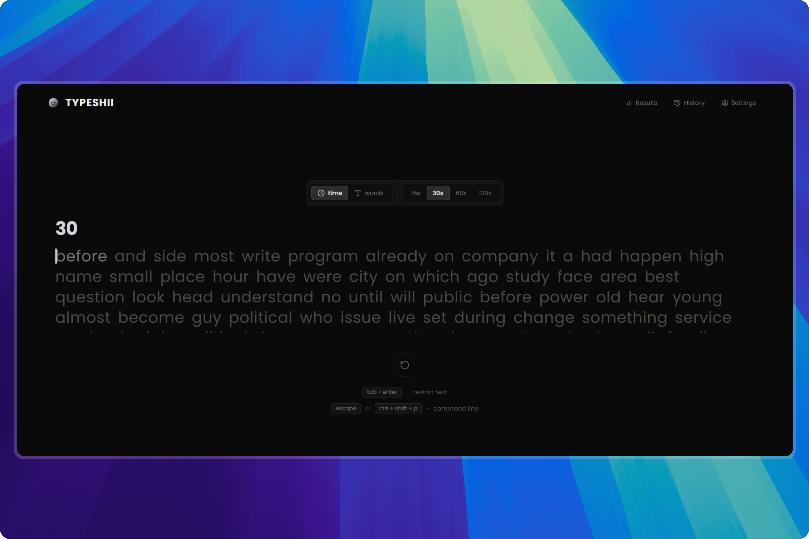

# ⚡ TypeShi

<div align="center">

  <h3>Pure Speed & Keystroke Precision</h3>

  <p>A minimalist, high-performance typing test web application built with modern web technologies, zero-latency mechanical switch audio, and rich real-time analytics.</p>

  [](https://nextjs.org/)
  [](https://react.dev/)
  [](https://www.typescriptlang.org/)
  [](https://tailwindcss.com/)
  [](LICENSE)

  <br/><br/>

  

</div>

---

## ✨ Features

- **⚡ Zero Input Latency**: Ultra-responsive keystroke engine engineered for competitive typing precision.
- **🔊 Synthesized Mechanical Audio**: Authentic mechanical switch sound effects generated entirely in real-time using the **Web Audio API** — zero audio asset downloads, zero delay.
- **🎯 Multiple Test Modes**:
  - **Time Modes**: `15s`, `30s`, `60s`, `120s`
  - **Word Modes**: `10`, `25`, `50`, `100` words
- **📊 In-Depth Analytics**:
  - Net WPM & Raw WPM calculation
  - Keystroke accuracy & consistency tracking
  - Interactive performance progression timeline chart powered by **Recharts**
  - Character breakdown (Correct, Incorrect, Extra, Missed)
  - Common mistakes and word-by-word latency analysis
- **🎨 Minimalist Dark Aesthetic**: Designed for high focus with distraction-free UI, smooth micro-interactions, and carefully tuned contrast.
- **⚙️ Customization**:
  - Configurable caret styles: `Line`, `Block`, `Underline`
  - Toggleable live WPM and accuracy indicators
  - Audio switch on/off toggle
- **📈 Local History & Progress**: Automatically saves completed test sessions to `localStorage` with historical trends and personal bests.
- **⌨️ Keyboard-First UX**: Quick reset shortcuts (`Tab` + `Enter`), seamless navigation, and autofocus.

---

## 🛠️ Tech Stack

- **Framework**: [Next.js 15](https://nextjs.org/) (App Router)
- **Library**: [React 19](https://react.dev/)
- **Language**: [TypeScript](https://www.typescriptlang.org/)
- **Styling**: [Tailwind CSS](https://tailwindcss.com/)
- **Charts**: [Recharts](https://recharts.org/)
- **Icons**: [Lucide React](https://lucide.dev/)
- **Sound**: Native Web Audio API Synthesizer

---

## 🚀 Getting Started

### Prerequisites

Ensure you have the following installed on your machine:
- **Node.js**: `v18.18.0` or higher (Node 20+ recommended)
- **npm**, **yarn**, or **pnpm**

### Installation

1. **Clone the repository**:
   ```bash
   git clone https://github.com/ayaanshilledar/Typshiii.git
   cd Typshiii
   ```

2. **Install dependencies**:
   ```bash
   npm install
   ```

3. **Run the development server**:
   ```bash
   npm run dev
   ```

4. **Open in browser**:
   Navigate to [http://localhost:3000](http://localhost:3000) to start typing!

---

## 📜 Available Scripts

| Command | Description |
| :--- | :--- |
| `npm run dev` | Starts the Next.js development server on `http://localhost:3000` |
| `npm run build` | Compiles and builds the production application |
| `npm run start` | Runs the production build locally |
| `npm run lint` | Runs ESLint to check for code quality and style issues |

---

## 📂 Project Structure

```text
├── app/
│   ├── globals.css         # Global design tokens and animations
│   ├── layout.tsx          # Root layout with navbar and footer
│   ├── page.tsx            # Main typing arena page
│   ├── results/            # Detailed post-test results page
│   ├── history/            # User session history and progress charts
│   └── settings/           # User configuration view
├── components/
│   ├── history/            # History table, overview cards, progress charts
│   ├── layout/             # Navbar, Footer, Brand Logo (Blobatar)
│   ├── results/            # Result summary, WPM chart, error & word analysis
│   ├── settings/           # Settings modal and preferences
│   └── typing/             # Typing test arena, live metrics, word display
├── lib/
│   ├── audio/              # Web Audio API mechanical switch synthesizer
│   ├── storage/            # LocalStorage session persistence utilities
│   ├── typing/             # Typing engine state, types, and metric calculations
│   ├── words/              # Curated typing dictionary and word bank
│   └── utils.ts            # Classnames and formatting helpers
└── public/                 # Static assets
```

---

## ⌨️ Keyboard Shortcuts

| Shortcut | Action |
| :--- | :--- |
| `Tab` + `Enter` | Instantly restart / reset the test |
| `Esc` | Close open modals / overlays |
| Any Alphanumeric key | Immediately starts the test and timer |

---

## 🤝 Contributing

Contributions, issues, and feature requests are welcome! Feel free to check the [issues page](https://github.com/ayaanshilledar/Typshiii/issues).

See [CONTRIBUTING.md](CONTRIBUTING.md) for detailed guidelines on how to get started.

---

## 📄 License

This project is licensed under the **MIT License** — see the [LICENSE](LICENSE) file for details.

---

<div align="center">
  Crafted with ❤️ by <a href="https://github.com/ayaanshilledar">Ayaan Shilledar</a>
</div>
